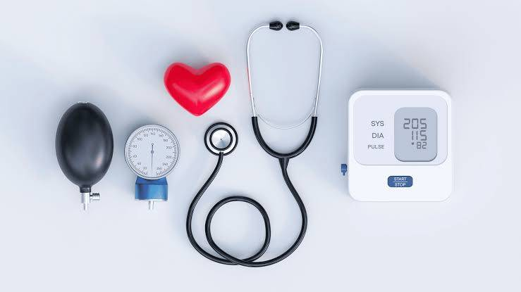
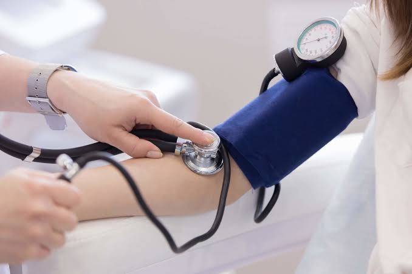
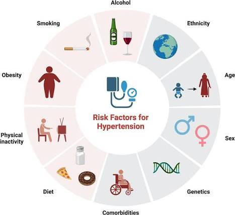
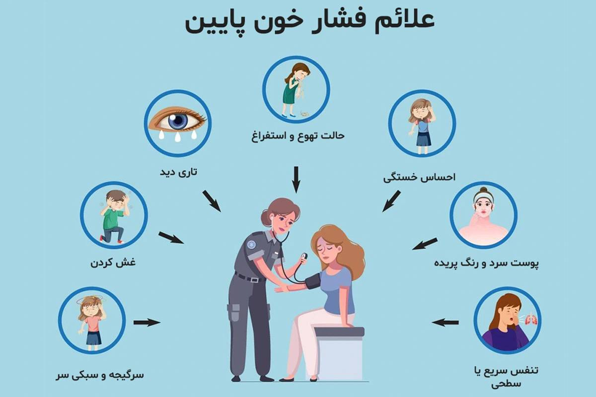
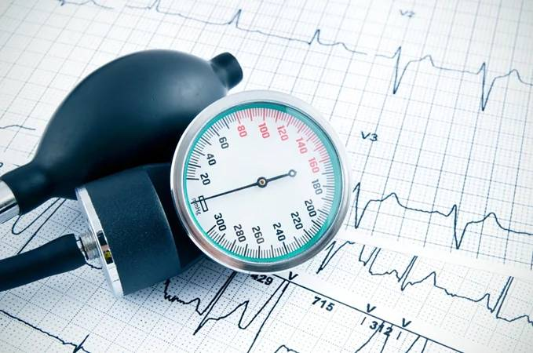
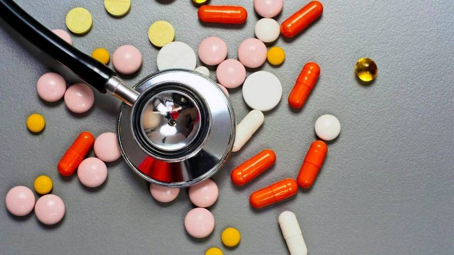
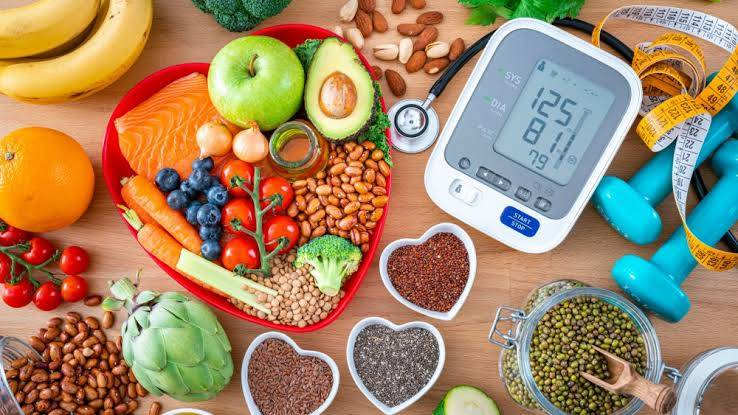
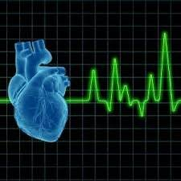

<!DOCTYPE html>
<html lang="en">
<head>
    <meta charset="UTF-8">
    <meta name="viewport" content="width=device-width, initial-scale=1.0">
    <title>Hypertension - High Blood Pressure</title>
    
</head>
<body>

    

        <h1>🩸 Hypertension (High Blood Pressure)</h1>
        
The Silent Killer - Know the Facts, Save Your Life

    

    <!-- Tabs Navigation -->
    <ul class="nav-tabs">
        <li><button class="tab-btn active" data-tab="intro">📖 Introduction</button></li>
        <li><button class="tab-btn" data-tab="causes">🩺 Causes</button></li>
        <li><button class="tab-btn" data-tab="symptoms">⚠️ Symptoms</button></li>
        <li><button class="tab-btn" data-tab="diagnosis">🔬 Diagnosis</button></li>
        <li><button class="tab-btn" data-tab="treatment">💊 Treatment</button></li>
        <li><button class="tab-btn" data-tab="prevention">🛡️ Prevention</button></li>
        <li><button class="tab-btn" data-tab="conclusion">📖 Conclusion</button></li>
    </ul>

    <!-- Tab Content -->
    

        <!-- Introduction -->
        

            

                
                

                
Measuring blood pressure - First step to diagnosis

            

            

                <h2>📌 What is Hypertension?</h2>
                
Hypertension, commonly known as high blood pressure, is a long-term medical condition in which the blood pressure in the arteries is persistently elevated. It is often called the <strong>"silent killer"</strong> because it usually has no warning signs or symptoms, but can lead to serious health problems like heart attack, stroke, and kidney failure.

                
The disease occurs mainly in adults over 40, but younger people can also be affected. According to WHO, <strong>1.28 billion adults worldwide</strong> have hypertension, and nearly half are unaware of their condition.

            

        

        <!-- Causes -->
        

            <h2>🩺 Causes & Risk Factors</h2>
            

                
                
Common risk factors for hypertension

            

            
Hypertension is divided into two types:

            <ul>
                <li><strong>Primary (Essential) Hypertension:</strong> No single identifiable cause; develops gradually over many years. Risk factors include age, genetics, obesity, high salt intake, lack of physical activity, and stress.</li>
                <li><strong>Secondary Hypertension:</strong> Caused by an underlying condition such as kidney disease, adrenal gland tumors, thyroid problems, or use of certain medications.</li>
            </ul>
            

                

1 in 3

Adults have hypertension

                

50%

Unaware of their condition

            

        

        <!-- Symptoms -->
        

            <h2>⚠️ Warning Signs & Symptoms</h2>
            

                
                
Severe headache and chest pain are warning signs

            

            
Most people with hypertension have no symptoms at all. However, extremely high blood pressure (hypertensive crisis) may cause:

            <ul>
                <li>Severe headaches (especially at the back of the head)</li>
                <li>Shortness of breath</li>
                <li>Nosebleeds</li>
                <li>Chest pain</li>
                <li>Vision problems or blurred vision</li>
                <li>Blood in urine</li>
                <li>Ringing in the ears (tinnitus)</li>
            </ul>
            
<strong>⚠️ Note:</strong> Regular blood pressure checks are essential because symptoms usually appear only when the condition has already caused organ damage.

        

        <!-- Diagnosis -->
        

            <h2>🔬 How is Hypertension Diagnosed?</h2>
            

                
                
Regular monitoring at home is important

            

            
Diagnosis is made by measuring blood pressure using a sphygmomanometer (blood pressure cuff). According to standard guidelines:

            

                
<strong>🟢 Normal:</strong> Less than 120/80 mm Hg

                
<strong>🟡 Elevated:</strong> 120-129 / less than 80 mm Hg

                
<strong>🟠 Stage 1 Hypertension:</strong> 130-139 / 80-89 mm Hg

                
<strong>🔴 Stage 2 Hypertension:</strong> 140 or higher / 90 or higher mm Hg

                
<strong>⚫ Hypertensive Crisis:</strong> Higher than 180/120 mm Hg (requires immediate medical attention)

            

            
Doctors may also order blood tests, urine tests, ECG, or echocardiogram to check for complications.

        

        <!-- Treatment -->
        

            <h2>💊 Treatment Options</h2>
            

                
                
Common blood pressure medications

            

            
Treatment includes lifestyle changes and medications:

            <ul>
                <li><strong>Lifestyle modifications:</strong> Reduce salt intake, eat more fruits/vegetables (DASH diet), exercise regularly (at least 30 minutes daily), maintain healthy weight, limit alcohol, and quit smoking.</li>
                <li><strong>Common medications:</strong> ACE inhibitors (Lisinopril), ARBs (Losartan), Calcium channel blockers (Amlodipine), Diuretics (Hydrochlorothiazide), Beta-blockers (Metoprolol).</li>
            </ul>
            

                
<strong>💡 Important Note:</strong> Most patients need to take medication for life. Never stop medication without doctor's advice. Regular follow-up is essential.

            

        

        <!-- Prevention -->
        

            <h2>🛡️ Prevention Tips</h2>
            

                
                
Regular exercise and healthy eating are key

            

            <ul>
                <li>Check your blood pressure regularly after age 18</li>
                <li>Eat a balanced, low-sodium diet (less than 5g salt per day)</li>
                <li>Exercise at least 150 minutes per week (brisk walking, swimming, cycling)</li>
                <li>Maintain a healthy BMI (18.5-24.9)</li>
                <li>Manage stress through meditation, yoga, or hobbies</li>
                <li>Limit caffeine and avoid recreational drugs</li>
                <li>Get 7-8 hours of quality sleep each night</li>
            </ul>
        

        <!-- Conclusion -->
        

            <h2>📖 Conclusion</h2>
            

                
                
A healthy heart starts with healthy habits

            

            
Hypertension is manageable and preventable. Regular monitoring, healthy lifestyle choices, and following prescribed treatments can significantly reduce risks of heart attack, stroke, and kidney disease. Education and awareness are the first steps toward better cardiovascular health.

            
The fight against high blood pressure demonstrates how simple changes in daily habits can save millions of lives worldwide. <strong>Check your blood pressure today!</strong>

            

                

10.4M

Annual deaths from hypertension

                

1.28B

People affected worldwide

            

        

    

    <footer>
        
Sources: World Health Organization (WHO) | American Heart Association | CDC | Mayo Clinic

        
This information is for educational purposes. Always consult a healthcare provider.

        
Created by Zahra Mahmoodi - Health Education Resource | 2025

    </footer>

</body>
</html>
